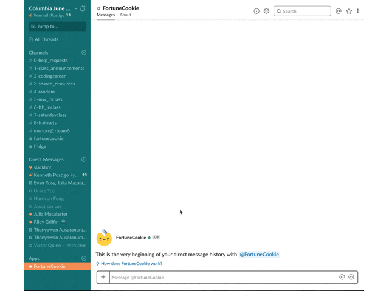

# Fortune Cookie
A fun way to add some mystery to your workspace's Slack channel!

## How to Use the App
For information on how to install our app on Slack or how to use it via email & web instead, check out [our website](https://fortune-cookie-bot.herokuapp.com).

## Project Details
This project was coded for the Columbia Full Stack Web Development Coding Bootcamp by [Sandy Yeung](https://www.sandynism.github.io), [Evan Ross](https://evansimonross.github.io/), [Julia Macalaster](https://www.juliamacalaster.com), and [Kenneth Postigo](https://www.kennethpostigo.me/).

## Preview

## Technologies
- Our backend node server uses [express.js](https://www.npmjs.com/package/express) and is deployed by [heroku](https://dashboard.heroku.com/).
- Serverside database management is done via [sequelize](https://www.npmjs.com/package/sequelize) using [mysql2](https://www.npmjs.com/package/mysql2).
- API calls within our server and to other servers are handled by [axios](https://www.npmjs.com/package/axios). In addition to axios, some Slack App API calls are done via the [slackbots](https://www.npmjs.com/package/slackbots) NPM package. Email is via [nodemailer](https://www.npmjs.com/package/nodemailer).
- Our templating engine is [handlebars](http://handlebarsjs.com/), via the [express-handlebars](https://www.npmjs.com/package/express-handlebars) NPM package.
- Text filtering courtesy of the [bad-words](https://www.npmjs.com/package/bad-words) NPM package.
- Although we wanted to focus on user-generated fortunes, we did use the [Fortune Cookie API](http://fortunecookieapi.herokuapp.com/) for their handy "Learn Chinese" lessons which a user may randomly receive, if they're lucky!

## Credits
- Fortune cookie icon from [Flaticon](https://www.flaticon.com/free-icon/fortune-cookie_284776).
- Fortune cookie exploitable courtesy of [Google images](https://media.gettyimages.com/photos/fortune-cookies-with-blank-paper-picture-id177327669?b=1&k=6&m=177327669&s=612x612&w=0&h=byJXiG4yZQUmPTZJgt5n4mMjSG3PX9IKLHBs7NlUJaA=).
